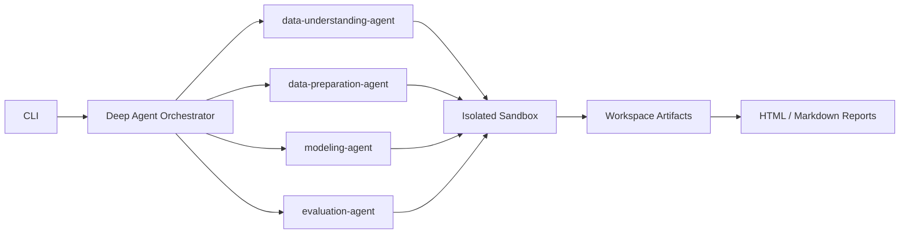

# ML Agent — Multi-Agent Tabular ML Pipelines

Autonomous end-to-end tabular machine learning pipelines powered by [LangChain Deep Agents](https://docs.langchain.com/oss/python/deepagents/overview). Specialized sub-agents handle each stage with sandboxed code execution, iterative refinement, and a full CLI.

## Architecture



| Stage | Sub-agent | Outputs |
|-------|-----------|---------|
| Data understanding | `data-understanding-agent` | `eda_summary.json`, plots |
| Data preparation | `data-preparation-agent` | Train/test CSV splits |
| Modeling | `modeling-agent` | `model.pkl` |
| Evaluation | `evaluation-agent` | `evaluation_report.json`, metrics |

## Features

- **Deep Agents integration** — `create_deep_agent` orchestrator with four stage sub-agents and custom pipeline tools
- **Sandbox iteration** — Isolated subprocess execution, per-iteration logs, automatic retries, metric parsing via `MLAGENT_METRIC:` lines
- **Continuous optimization** — Modeling and evaluation stages track best metrics across iterations, keep refining until thresholds are met and improvement plateaus, then restore the best code/artifacts
- **Cross-agent validation** — Required artifacts checked between stages; incompatible handoffs raise clear errors
- **CLI** — Run, monitor, inspect artifacts, history, export code, generate reports, rerun with new parameters
- **Template mode** — Deterministic production-ready code (no API key) for benchmarks and CI
- **Agent mode** — Full LLM-driven code generation and refinement when `OPENROUTER_API_KEY` is set

## Setup

```bash
cd mlagent
python3 -m venv .venv
source .venv/bin/activate
pip install -e .
cp .env.example .env   # optional, for agent mode
```

## Quick start

```bash
# List datasets and pipelines
mlagent configs

# Run full pipeline (template mode, no API key)
mlagent run iris

# Run with live progress
mlagent run breast_cancer --watch

# Agent mode (requires OPENROUTER_API_KEY)
mlagent run wine --mode agent

# Use a specific OpenRouter model
mlagent run wine --mode agent --model openrouter:anthropic/claude-sonnet-4

# Your own CSV file
mlagent run my_project --csv /path/to/data.csv --target label_column -p binary_classification
mlagent run my_project --csv ./data.csv --target price --task-type regression -p regression

# Inspect run
mlagent status
mlagent artifacts <run_id>
mlagent history <run_id> --stage evaluation

# Reports and export
mlagent report <run_id>
mlagent export <run_id> -o ./export

# Re-run with stricter threshold
mlagent rerun <run_id> --min-metric 0.85
```

## Benchmarks

Run all standard dataset benchmarks (iris, wine, breast_cancer, diabetes):

```bash
python scripts/run_benchmarks.py
```

See [docs/BENCHMARKS.md](docs/BENCHMARKS.md) for expected metrics.

## Configuration

- `configs/datasets.yaml` — Public datasets (sklearn + Titanic URL)
- `configs/pipelines.yaml` — Pipeline types and metric thresholds
- `.env` — `OPENROUTER_API_KEY`, `MLAGENT_MODEL`, `MLAGENT_EXECUTION_MODE`, optimization settings (`MLAGENT_OPTIMIZATION_*`)

## Project layout

```
mlagent/
├── mlagent/
│   ├── agents/          # Deep agent orchestrator, sub-agents, tools
│   ├── cli/             # Typer CLI
│   ├── pipeline/        # Runner, stages, templates, validation
│   ├── sandbox/         # Isolated executor
│   ├── reporting/       # HTML / Markdown reports
│   └── storage/         # Run workspaces
├── configs/
├── scripts/
├── tests/
└── docs/
```

## License

MIT
